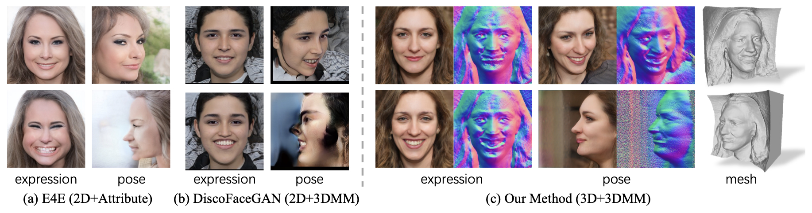

# Cgof++: Controllable 3d face synthesis with conditional generative occupancy fields<br>
## Official PyTorch implementation of the [TPAMI 2023 paper](https://arxiv.org/abs/2211.13251)



**Cgof++: Controllable 3d face synthesis with conditional generative occupancy fields**<br>
[Keqiang Sun](https://keqiangsun.github.io), [Shangzhe Wu](https://elliottwu.com), [Ning Zhang](https://scholar.google.com/citations?user=Hy0rk7IAAAAJ&hl=zh-TW), [Zhaoyang Huang](https://drinkingcoder.github.io), [Quan Wang](https://scholar.google.com/citations?user=KmxEHm4AAAAJ&hl=zh-TW), [Hongsheng Li](https://www.ee.cuhk.edu.hk/~hsli/)

## Run Inference

### 1. Pose Variation
```bash
CUDA_VISIBLE_DEVICES=0 python vis.py \
--network ./outputs/network-snapshot-001612.pkl \
--trunc 0.7 \
--outdir ./vis_results/eg3d_recon4_snm_depr100_ldmk6_warp30 \
--shapes False \
--reload_modules True \
--factor 3 \
--subject 33 \
--variation 5 \
--get_norm False \
--get_input True \
--merge True \
--nrow 5  \
--neural_rendering_resolution 256 \
--angle_multiplier 1.0 \
```

### 2. Facial Expression Variation
```bash
CUDA_VISIBLE_DEVICES=0 python vis.py \
--network ./outputs/network-snapshot-001612.pkl \
--trunc 0.7 \
--outdir ./vis_results/eg3d_recon4_snm_depr100_ldmk6_warp30 \
--shapes False \
--reload_modules True \
--factor 1 \
--subject 33 \
--variation 25 \
--get_norm False \
--get_input True \
--angle_multiplier 0.0 \
--merge True \
--nrow 5  \
--neural_rendering_resolution 256
```


### 3. Inversion and Editing
#### 3.1 Use Deep3DFaceRecon_pytorch to perform the face detection and alignment
```bash
# cd ./eg3d/eg3d_pti_inversion-main/Deep3DFaceRecon_pytorch
python process_test_images.py --input_dir /mnt/afs/kqsun/Tasks/eg3d_022/eg3d/eg3d_pti_inversion-main/data/scene_1/ref_img --gpu 0
```

#### 3.2 perform GAN Inversion
```bash
# before editing, modify the config in: /home/kqsun/Tasks/eg3d_022/eg3d/eg3d/inversion/configs/paths_config.py
# cd /mnt/afs/kqsun/Tasks/eg3d_022/eg3d/eg3d
python inversion/run_pti.py
```

#### 3.3 edit the facial expression of the inversion result 
```bash
# cd /home/kqsun/Tasks/eg3d_022/eg3d/eg3d/
python edit_latent_code.py --network ./inversion/outputs/embeddings/tom/PTI/tom/model_tom.pt --w_path ./inversion/outputs/embeddings/tom/PTI/tom/optimized_noise_dict.pickle --c_path ./proj_data/input2/epoch_20_000000/cameras.json --z_path ./proj_data/input2/crop_1024/epoch_20_000000/tom.mat --outdir ./edit_results/tom/warp30_1612 --sample_mult 2 --use_face_recon True --trunc 1.0 --trunc-cutoff 100
```


## Citation
```
@article{sun2023cgof++,
  title={Cgof++: Controllable 3d face synthesis with conditional generative occupancy fields},
  author={Sun, Keqiang and Wu, Shangzhe and Zhang, Ning and Huang, Zhaoyang and Wang, Quan and Li, Hongsheng},
  journal={IEEE transactions on pattern analysis and machine intelligence},
  year={2023},
  publisher={IEEE}
}
```